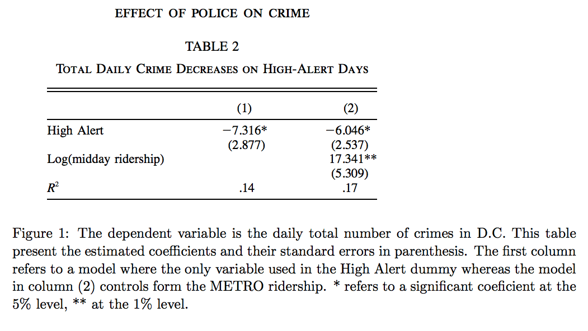
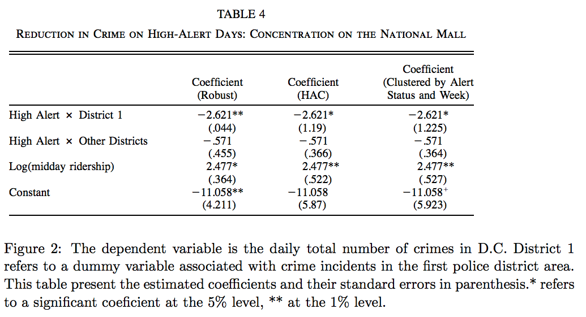

# ECO 395M: Exercises 3

Due date: Monday, April 1, 5 PM US Central Time.  Email submissions to ruizuo11@utexas.edu.  

## What causes what?

First, listen to [this podcast from Planet Money.](https://www.npr.org/sections/money/2013/04/23/178635250/episode-453-what-causes-what)  Then use your knowledge of statistical learning to answer the following questions.

1. Why can’t I just get data from a few different cities and run the regression of “Crime” on “Police” to understand how more cops in the streets affect crime? (“Crime” refers to some measure of crime rate and “Police” measures the number of cops in a city.)  

2. How were the researchers from UPenn able to isolate this effect? Briefly describe their approach and discuss their result in the “Table 2” below, from the researchers' paper.  

3. Why did they have to control for Metro ridership? What was that trying to capture?   

4. Below I am showing you "Table 4" from the researchers' paper.  Just focus
on the first column of the table. Can you describe the model being estimated here?
What is the conclusion?

## Tree modeling: dengue cases

In this question, you will look at [dengue.csv](../data/dengue.csv), containing data on dengue fever in Latin America.  This data was compiled by a group of students in spring 2017 for their course project.  I'll let them describe the data and the problem in their own words:

> As one of the most prolific diseases in the world, dengue fever is a mosquito-borne infection that affects almost half a billion people every year. Mainly endangering the tropics, the fever at best causes symptoms like vomiting and at worst can turn life-threatening. Thousands die every year while researchers attempt to find the best way to fight the pandemic.  The disease first started to become prevalent after World War II as mosquitoes were able to travel around the world much easier than before. Since the disease can’t spread directly between people, the spread of mosquitoes led to the spread of dengue fever. Specifically, the Aegypti mosquito is the main vector for the virus. Researchers understand this link and have turned their attention to efforts like eliminating still water where mosquitoes breed and encouraging residents to wear clothes that cover more of their skin. If you want to stop dengue fever, you have to stop the mosquitoes.

> This dataset includes weekly information from two Latin American cities: San Juan, Puerto Rico and Iquitos, Peru. Along with the number of dengue fever cases each city encountered in the week, included are various environmental measures that describe precipitation, temperature, vegetation, and more. The variables are all intended to be in some way related to how mosquitoes breed and spread. Studies have shown that mosquitoes breed in hot, warm, and green areas. The dataset includes complete data on over 1100 weeks from these two cities in years between 1990 and 2010.

Each row in the data set corresponds to a single week in a single city.  The variables in the data set are as follows:  
- total_cases: Total recorded number of dengue fever cases that week. This is the outcome variable of interest in all regression models.  
- city: City in which the data was recorded (sj = San Juan, Puerto Rico; iq = Iquitos, Peru)  
- season: Season the data was recorded (spring, summer, fall, winter)  
- specific_humidity: Average specific humidity in grams of water per kilogram of air for the week. This is a raw measure of humidity based purely on how much water is in the air.  
- tdtr_k: Average Diurnal Temperature Range (DTR) for the week. DTR is the difference between the maximum and minimum temperature for a single day.  
- precipitation_amt: Rainfall for the week in millimeters   

There are a few other meteorological variables as well -- feel free to use anything in the data set as a feature.  

Your task is to use _CART_, _random forests_, and _gradient-boosted trees_ to predict dengue cases (or log dengue cases -- your choice, just explain) based on the features available in the data set.  As we usually do, hold out some of the data as a testing set to quantify the performance of these models.  (That is, any cross validation should be done _only_ on the training data, with the testing data held as a final check to compare your best CART model vs. your best random forest model vs. your best boosted tree model.)  Then, for whichever model has the better performance on the testing data, make three partial dependence plots:  

- specific_humidity  
- precipitation_amt   
- wild card/writer's choice: you choose a feature that looks interesting and make a partial dependence plot for that.  

## Predictive model building: green certification

Consider the data set on green buildings in [greenbuildings.csv](../data/greenbuildings.csv), which we've examined before in the context of data visualization.  This contains data on 7,894 commercial rental properties from across the United States. Of these, 685 properties have been awarded either LEED or EnergyStar certification as a green building.  Here is a list of the variables:

- CS.PropertyID:  the building's unique identifier in the database.  
- cluster:  an identifier for the building cluster, with each cluster containing one green-certified building and at least one other non-green-certified building within a quarter-mile radius of the cluster center.  
- size:  the total square footage of available rental space in the building.  
- empl.gr:  the year-on-year growth rate in employment in the building's geographic region.  
- Rent:  the rent charged to tenants in the building, in dollars per square foot per calendar year.  
- leasing.rate:  a measure of occupancy; the fraction of the building's available space currently under lease.  
- stories:  the height of the building in stories.  
- age:  the age of the building in years.  
- renovated:  whether the building has undergone substantial renovations during its lifetime.  
- class.a, class.b:  indicators for two classes of building quality (the third is Class C).  These are relative classifications within a specific market.  Class A buildings are generally the highest-quality properties in a given market.  Class B buildings are a notch down, but still of reasonable quality.  Class C buildings are the least desirable properties in a given market.  
- green.rating:  an indicator for whether the building is either LEED- or EnergyStar-certified.  
- LEED, Energystar:  indicators for the two specific kinds of green certifications.  
- net:  an indicator as to whether the rent is quoted on a "net contract" basis.  Tenants with net-rental contracts pay their own utility costs, which are otherwise included in the quoted rental price.  
- amenities:  an indicator of whether at least one of the following amenities is available on-site: bank, convenience store, dry cleaner, restaurant, retail shops, fitness center.  
- cd.total.07:  number of cooling degree days in the building's region in 2007.  A degree day is a measure of demand for energy; higher values mean greater demand.  Cooling degree days are measured relative to a baseline outdoor temperature, below which a building needs no cooling.  
- hd.total07:  number of heating degree days in the building's region in 2007.  Heating degree days are also measured relative to a baseline outdoor temperature, above which a building needs no heating.  
- total.dd.07:  the total number of degree days (either heating or cooling) in the building's region in 2007.  
- Precipitation:  annual precipitation in inches in the building's geographic region.
- Gas.Costs:  a measure of how much natural gas costs in the building's geographic region.  
- Electricity.Costs:  a measure of how much electricity costs in the building's geographic region.  
- City_Market_Rent:  a measure of average rent per square-foot per calendar year in the building's local market.    

Your goal is to build the best predictive model possible for _revenue per square foot per calendar year_, and to use this model to quantify the average change in rental income per square foot (whether in absolute or percentage terms) associated with green certification, holding other features of the building constant. (This might entail, for example, a partial dependence plot, depending on what model you work with here.) Note that revenue per square foot per year is the product of two terms: `rent` and `leasing_rate`!  This reflects the fact that, for example, high-rent buildings with low occupancy may not actually bring in as much revenue as lower-rent buildings with higher occupancy.  

You can choose whether to consider LEED and EnergyStar separately or to collapse them into a single "green certified" category.  You can use any modeling approaches in your toolkit (regression, variable selection, trees, etc), and you should also feel free to do any feature engineering you think helps improve the model.  Just make sure to explain what you've done.  

Write a short report, no more than the equivalent of about 4 pages, detailing your methods, modeling choice, and conclusions.  

## Predictive model building: California housing

The data in [CAhousing.csv](../data/CAhousing.csv) containts data at the census-tract level on residential housing in the state of California.  Each row is a [census tract](https://libguides.lib.msu.edu/tracts), and the columns are as follows:  

- longitude, latitude: coordinates of the geographic centroid of the census tract  
- housingMedianAge: median age in years of all residential households in the census tract  
- population: total population of the tract  
- households: total number of households in the tract.  
- totalRooms, totalBedrooms: total number of rooms and bedrooms for households in the tract.  NOTE: these are _totals_, not averages.  Consider standardizing by households.  
- medianIncome: median household income in USD for all households in the tract.  
- medianHouseValue: median market value of all households in the tract.  

Your task is to build the best predictive model you can for `medianHouseValue`, using the other available features.  Write a short report detailing your methods.  Make sure your report includes an estimate for the overall out-of-sample accuracy of your proposed model.  Also include three figures:  

- a plot of the original data, using a color scale to show medianHouseValue (or log medianHouseValue) versus longitude (x) and latitude (y).  
- a plot of your model's predictions of medianHouseValue (or log medianHouseValue) versus longitude (x) and latitude (y).  
- a plot of your model's errors/residuals (or log residuals) versus longitude (x) and latitude (y).

You can get nearly full credit (but not 100%) without a mapping package, i.e. just treating longitude and latitude as generic x/y coordinates.  But a modest number of points will be reserved for those who can successfully show these plots in a visually pleasing fashion on an _actual map of California_.  This will entail learning how to use an R/python package capable of making maps.  (We haven't covered this in class, but a major part of being a data scientist is learning how to use new software tools and libraries "on the fly" like this.)  Consider `ggmap` as a good starting point, but you can use whatever R tools you want here.  

